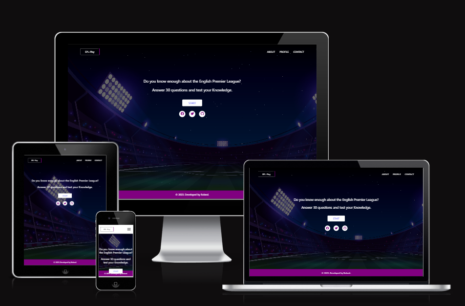

# EPL Play
Interactive Frontend Development Milestone Project 2

[View Live webpage here](https://bodeode1.github.io/EPL-PLAY/)

## Table of Contents

1. [Introduction](#Introduction)
2. [UX Development Plane](#UX Development Plane)
     1. [Strategy Plane](Strategy Plane)
        - User Goals
        - Site Owner Goals
     2. User Experience

## Introduction

Welcome to EPL PLAY! EPL PLAY is a website-based quiz game designed to test users' knowledge of the English Premier League. Whether you're a die-hard fan or just getting started, this game will challenge your understanding of Premier League history, teams, players, and memorable moments.
This quiz game is the second of my Milestone Project for the Full Stack Web Development Program at  Code Institute. The aim was to design an interactive and responsive website using HTML5, CSS, and JavaScript.

## UX Development Plane
## 1. Strategy Plane

### **User Goals**
- Test and improve knowledge of the Premier League.
- Challenge oneself with a fun and engaging quiz game.
- Learn interesting facts and trivia about Premier League history, teams, and players.
- Sharpen football knowledge and stay up-to-date with the league.
- Compete with friends or family to see who has the highest score.
- Enjoy a interactive and entertaining experience centered around the Premier League.

### **Site Owner Goals**
- Increase user engagement and encourage repeat visits to the game platform.
- Educate users about the history, teams, and players of the Premier League.
- Promote the love and passion for football by showcasing the excitement of the Premier League.
- Engage users and keep them entertained with an enjoyable quiz game experience.
- Establish the quiz game as a go-to resource for Premier League enthusiasts.

## 2. User Experience

### **Target Audience**
- Football enthusiasts and die-hard fans of the Premier League.
- Fans of specific Premier League teams who want to showcase their knowledge about their favorite club and rivals.
- Premier League followers seeking an interactive and engaging way to stay connected to the league.
- Anyone looking for an entertaining and educational activity centered around the Premier League.

### **First-time User**
-  To easily navigate and understand the interface of the Premier League quiz game.
-  To complete the quiz with a sense of accomplishment and satisfaction.
-  To get motivated to revisit the quiz game and improve their score or knowledge over time.
-  To enjoy a challenging yet enjoyable quiz game that caters to different levels of knowledge about the Premier League.

### **Returning User**
-  To track progress and improvement over time by comparing scores and achievements from previous quiz sessions.
-  To challenge oneself with new sets of questions and quizzes to test knowledge and learn more about the Premier League.
-  To share the Premier League quiz game with friends, family, or fellow football enthusiasts to spread the enjoyment and knowledge about the Premier League.

