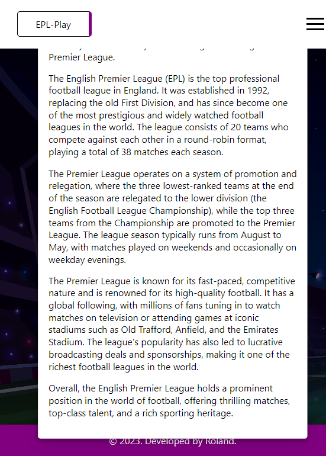

# EPL Play
Interactive Frontend Development Milestone Project 2

[View Live webpage here](https://bodeode1.github.io/EPL-PLAY/)

## Table of Contents

1. [Introduction](#introduction)
2. [UX Development Plane](#ux-development-plane)
     1. [Strategy Plane](#strategy-plane)
        - User Goals
        - Site Owner Goals
     2. [User Experience](#user-experience)
3. [Design](#design)
    1. [Design Choices](#design-choices)
    2. [Colour](#colour)
    3. [Fonts](#fonts)
    4. [Structure](#structure)
4. [Technologies Used](#technologies-used)
    1. [Languages](#languages)
    2. [Frameworks and Tools](#frameworks-and-tools)
5. [Features](#features)
6. [Testing](#validation)
    1. [HTML Validation](#HTML-validation)
    2. [CSS Validation](#CSS-validation)
    3. [JS Validation](#JS-Validation)
    4. [Accessibility](#accessibility)
    5. [Performance](#performance)
    6. [Responsiveness](#responsiveness)
    7. [Device testing](#performing-tests-on-various-devices)
    8. [Browser compatibility](#browser-compatibility)
7. [Deployment](#deployment)
8. [Credits](#credits)
9. [Acknowledgements](#acknowledgements)

## Introduction

Welcome to EPL PLAY! EPL PLAY is a website-based quiz game designed to test users' knowledge of the English Premier League. Whether you're a die-hard fan or just getting started, this game will challenge your understanding of Premier League history, teams, players, and memorable moments.

This quiz game is the second milestone project for the Full Stack Web Development Program at Code Institute. The aim was to design an interactive and responsive website using HTML5, CSS, and JavaScript.

## UX Development Plane
##  Strategy Plane

### **User Goals**
- Test and improve knowledge of the Premier League.
- Challenge oneself with a fun and engaging quiz game.
- Learn interesting facts and trivia about Premier League history, teams, and players.
- Sharpen football knowledge and stay up-to-date with the league.
- Compete with friends or family to see who has the highest score.
- Enjoy a interactive and entertaining experience centered around the Premier League.

### **Site Owner Goals**
- Increase user engagement and encourage repeat visits to the game platform.
- Educate users about the history, teams, and players of the Premier League.
- Promote the love and passion for football by showcasing the excitement of the Premier League.
- Engage users and keep them entertained with an enjoyable quiz game experience.
- Establish the quiz game as a go-to resource for Premier League enthusiasts.

##  User Experience

### **Target Audience**
- Football enthusiasts and die-hard fans of the Premier League.
- Fans of specific Premier League teams who want to showcase their knowledge about their favorite club and rivals.
- Premier League followers seeking an interactive and engaging way to stay connected to the league.
- Anyone looking for an entertaining and educational activity centered around the Premier League.

### **First-time User**
-  To easily navigate and understand the interface of the Premier League quiz game.
-  To complete the quiz with a sense of accomplishment and satisfaction.
-  To get motivated to revisit the quiz game and improve their score or knowledge over time.
-  To enjoy a challenging yet enjoyable quiz game that caters to different levels of knowledge about the Premier League.

### **Returning User**
-  To track progress and improvement over time by comparing scores and achievements from previous quiz sessions.
-  To challenge oneself with new sets of questions and quizzes to test knowledge and learn more about the Premier League.
-  To share the Premier League quiz game with friends, family, or fellow football enthusiasts to spread the enjoyment and knowledge about the Premier League.

## Design

### **Design Choices**
The game was designed to stimulate users' senses, aiming to give them a sense of being present at a football field while playing the quiz. As such, a football field background image was inserted on every page of the website.

### **Colour**
For the color scheme, I opted for purple as the primary color throughout the website. This choice helps keep the website clean and simple.

### **Fonts**
I used Segoe UI and Lucida Sans for most of the content on the website, as they provide clarity and readability. Additionally, Courier New was chosen for buttons to give them a distinct style.

### **Structure**
The website consists of four separate pages, all of which are responsive across all devices:

Homepage: This page features an introductory message that introduces users to the website and the quiz. It sets the tone and prepares users for the gaming experience.

About Page: The about page provides information about EPL Play and gives a brief history of the English Premier League. It helps users understand the context and significance of the quiz.

Profile Page: Users can create a profile for themselves on this page, allowing for a personalized experience.

Contact Page: The contact page includes a simple form asking for users' email and name. This allows users to get in touch or provide feedback, fostering communication and interaction.

These design choices aim to create an engaging and visually appealing experience for users playing the Premier League Quiz game, while maintaining a consistent and user-friendly interface.

## Technologies Used

### **Languages**
- HTML
- CSS
- JavaScript

### **Frameworks and Tools**
- Git
- GitHub
- Gitpod
- Balsamiq
- Google Fonts
- Font Awesome

## Features
The page consists of four pages.

### **Logo and Navigation Bar**
- The navigation is fully responsive and collapses when the window is minimised.
- The Logo is a hyperlink that takes users back to the home page

Nav on Laptop

Nav on Mobile

### **About**
This page introduces users to EPL Play

About Page on Laptop</>

### **Profile**
Lets a user creates a profile. 

Profile Page Laptop

### **Contact**
On the contact page, users enter their names, enails and also leaves a feedback.

## Validation

### **HTML Validation**
The W3C Markup Validation Service was used to validate the HTML of the website. No errow was found.

index.html [results](https://validator.w3.org/nu/?doc=https%3A%2F%2Fbodeode1.github.io%2FEPL-PLAY%2Fabout.html) - No Errors Found

profile.html [results](https://validator.w3.org/nu/?doc=https%3A%2F%2Fbodeode1.github.io%2FEPL-PLAY%2Fprofile.html) - No Erros
Found

contact.html [results](https://validator.w3.org/nu/?doc=https%3A%2F%2Fbodeode1.github.io%2FEPL-PLAY%2Fcontact.html) - No Erros Found 

about.html [results](https://validator.w3.org/nu/?doc=https%3A%2F%2Fbodeode1.github.io%2FEPL-PLAY%2Fabout.html)

### **CSS Validation**
The W3C Jigsaw CSS Validation Service was used to validate the CSS of the website.

whole css [results](https://jigsaw.w3.org/css-validator/validator?uri=https%3A%2F%2Fbodeode1.github.io%2FEPL-PLAY%2F&profile=css3svg&usermedium=all&warning=1&vextwarning=&lang=en#warnings) - The Erros found were in relation to weekbit.

### **JS Validation**
[Code Beauty](codebeautify.org) was used to validate the JavaScript of the website.

#### script.js Validation
The result of the validation showed 29 warning signs but no error was found.

#### question.js Validation
The result of the validation returned 2 errors. 

#### main.js Validation
The result of the validation returned 2 errors. 

### Accessibility
The WAVE WebAIM web accessibility tool was used to ensure the website met accessibility standards.

index.html [results](https://wave.webaim.org/report#/https://bodeode1.github.io/EPL-PLAY/index.html) - Six erros relate to contrast and one error relates to no use of heading on the page.

game.html [results](https://wave.webaim.org/report#/https://bodeode1.github.io/EPL-PLAY/game.html) - Three errors were found relating to the use of no heading on the page.

### Performance 
Google Lighthouse Tool was used to test the performance of the website. 

### Responsiveness
The website is completely responsive and has been tested on mobile, tablet, and desktop devices.

### Browser compatibility
The website has been thoroughly tested on popular browsers, including Google Chrome, Safari, Mozilla Firefox, and Microsoft Edge.
- Google Chrome
- Safari
- Mozilla Firefox
- Microsoft Edge

## Deployment
The website was deployed using GitHub Pages by following these steps:
1. In the GitHub repository navigate to the Settings tab.
2. Select Pages from the menu on the left hand-side.
3. For the source select Branch: master.
4. After the webpage refreshes automatically a ribbon on the top says: "Your site is published at "https://bodeode1.github.io/EPL-PLAY/"

You can fork the repository by following these steps:
1. Go to the GitHub repository.
2. Click on Fork button in upper right hand corner.

You can clone the repository by following these steps:
1. Go to the GitHub repository.
2. Locate the Code button above the list of files and click it.
3. Select if you prefer to clone using HTTPS, SSH, or Github CLI and click the copy button to copy the URL to your clipboard.
4. Open Git Bash.
5. Change the current working directory to the one where you want the cloned directory.
6. Type git clone and paste the URL from the clipboard ($ git clone https://github.com/YOUR-USERNAME/YOUR-REPOSITORY)
7.Press Enter to create your local clone.

## Credits
Images not referenced below are owned by the developer.

### Media
The background image of the football pitch was sourced from pixabay.com
- Photo by Pixabay <a href="https://www.istockphoto.com/search/search-by-asset?affiliateredirect=true&assetid=643632382&assettype=image&utm_campaign=SRP_image_sponsored&utm_content=https%3A%2F%2Fpixabay.com%2Fimages%2Fsearch%2Ffootball%2520pitch%2F&utm_medium=affiliate&utm_source=pixabay&utm_term=football+pitch">Football Pitch</a>

### Code
In order of appearance:
- The HTML used for the website was learned from Code with Mosh on his website [Code with Mosh](https://codewithmosh.com/). Other HTML codes were learned from [W3 Schools](https://www.w3schools.com/), and Code Institute.
- The CSS used was also learned from Code with Mosh and on W3 Schools.
- JavaScript was also learned from Code with Mosh and from Code Institute and W3 Schools.

## Acknowledgements
I would like to express my gratitude to the following individuals:

- My mentor, Oluwaseun Owonikoko, for her invaluable feedback, advice, guidance, and support throughout the development process.
- A heartfelt thank you to my wife, Fortune Odebiyi, for her unwavering support, sacrifices, and constant encouragement.
- To my son, Iyinoluwa Odebiyi, for always believing in me and motivating me to pursue excellence.

